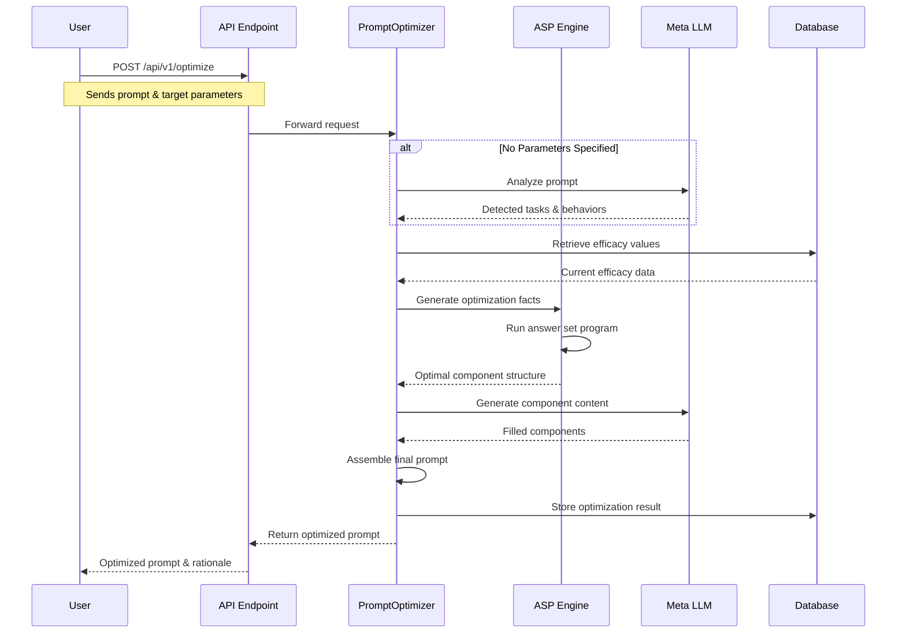
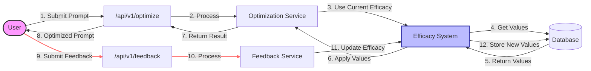
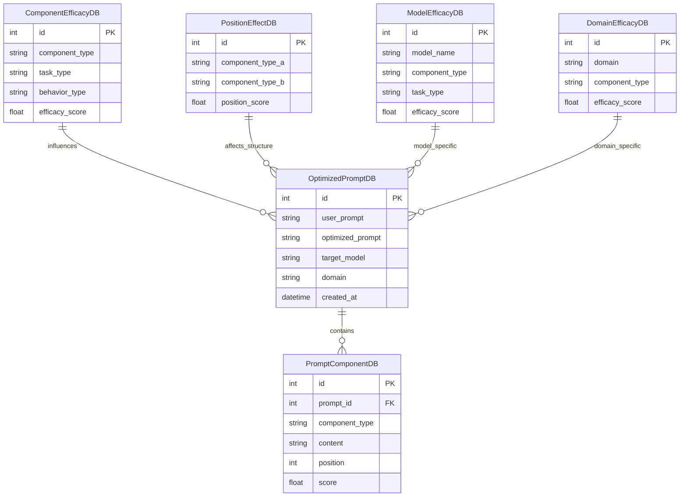
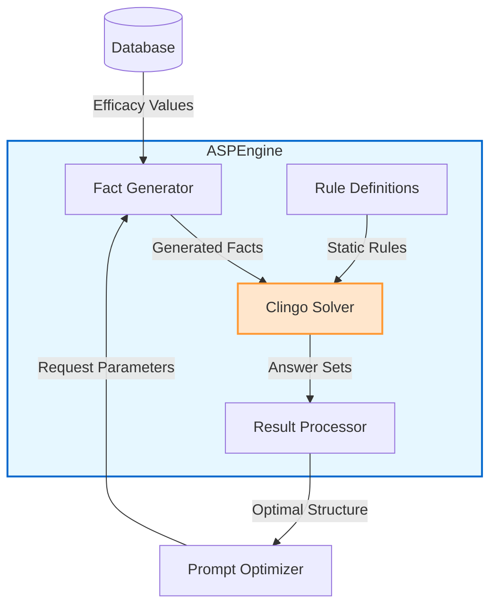

# InferPrompt Specifications

## Overview

InferPrompt is an AI prompt optimization system that uses Answer Set Programming (ASP) and large language models to analyze, structure, and optimize prompts for different AI models, tasks, and domains. The system learns from feedback to continuously improve its optimization capabilities.

## Functional Specifications

### Core Capabilities

1. **Prompt Optimization**
   - Analyze user prompts to identify tasks and behaviors
   - Determine optimal prompt structure based on component efficacy
   - Generate content for each component
   - Assemble components into a complete optimized prompt
   - Return structured results with rationale and scoring

2. **Prompt Analysis**
   - Detect reasoning tasks (deduction, induction, abduction, etc.)
   - Identify desired behaviors (precision, creativity, step-by-step, etc.)
   - Determine domain context (education, science, business, etc.)

3. **Feedback Processing**
   - Accept effectiveness ratings for components, tasks, and behaviors
   - Update efficacy values based on feedback
   - Apply learning to future optimizations

4. **History Management**
   - Store all optimization results
   - Retrieve past optimizations with filtering
   - Access specific optimization details

### API Endpoints

| Endpoint | Method | Purpose |
|----------|--------|---------|
| `/api/v1/optimize` | POST | Optimize a prompt based on specified parameters |
| `/api/v1/analyze` | POST | Analyze a prompt to detect tasks and behaviors |
| `/api/v1/feedback` | POST | Provide feedback to improve optimization |
| `/api/v1/history` | GET | Retrieve optimization history |
| `/api/v1/history/{id}` | GET | Get a specific optimized prompt |
| `/api/v1/health` | GET | System health check |

### User Workflows

1. **Direct Optimization**
   - User submits prompt with target tasks, behaviors, model, and domain
   - System returns optimized prompt structured in components

2. **Assisted Optimization**
   - User submits prompt without specifying parameters
   - System analyzes prompt to detect tasks and behaviors
   - System optimizes based on detected parameters
   - User provides feedback on results

3. **Learning Cycle**
   - System optimizes prompts based on current efficacy values
   - Users provide feedback on optimization effectiveness
   - System updates efficacy values based on feedback
   - Future optimizations incorporate learned improvements

### Workflow Diagrams

#### Prompt Optimization Process



#### Feedback Learning Loop



## Technical Specifications

### Architecture

1. **Application Layer**
   - FastAPI framework for API endpoints
   - Middleware for CORS, logging, and performance monitoring
   - Request/response validation using Pydantic models

2. **Service Layer**
   - **PromptOptimizer**: Orchestrates the optimization process
   - **MetaLLM**: Interacts with LLM APIs for analysis and generation
   - **ASPEngine**: Applies Answer Set Programming for structure optimization

3. **Data Layer**
   - SQLAlchemy ORM for database operations
   - SQLite database (configurable for other databases)
   - Models for prompts, components, efficacy values

### System Architecture Diagram

```mermaid
flowchart TB
    User([User]) <-->|HTTP Requests| API[FastAPI Endpoints]
    
    subgraph Application Layer
        API --> RequestValidation[Request Validation]
        RequestValidation --> OptimizeService[Optimization Service]
        RequestValidation --> AnalyzeService[Analysis Service]
        RequestValidation --> FeedbackService[Feedback Service]
        RequestValidation --> HistoryService[History Service]
    end
    
    subgraph Service Layer
        OptimizeService --> PromptOptimizer
        AnalyzeService --> MetaLLM
        FeedbackService --> MetaLLM
        HistoryService --> DB
        
        PromptOptimizer --> ASPEngine
        PromptOptimizer --> MetaLLM
        ASPEngine --> EfficacySystem[Efficacy System]
    end
    
    subgraph Data Layer
        DB[(SQLite Database)]
        DB <--> EfficacySystem
    end
    
    MetaLLM <-->|API Calls| ExternalLLM[External LLM APIs]
    
    classDef layer fill:#f9f9f9,stroke:#333,stroke-width:1px;
    class Application Layer,Service Layer,Data Layer layer;
```

### Data Models

1. **Enumerations**
   - `ComponentType`: Instruction, context, example, etc.
   - `TaskType`: Deduction, induction, abduction, etc.
   - `BehaviorType`: Precision, creativity, step-by-step, etc.

2. **Request/Response Models**
   - `OptimizationRequest`: User prompt and target parameters
   - `PromptComponent`: Individual component of a prompt
   - `OptimizedPrompt`: Complete optimized prompt with components

3. **Database Models**
   - `OptimizedPromptDB`: Stores complete optimized prompts
   - `PromptComponentDB`: Stores individual components
   - `ComponentEfficacyDB`: Stores effectiveness ratings
   - `PositionEffectDB`: Stores impact of component positions
   - `ModelEfficacyDB`: Stores model-specific efficacy
   - `DomainEfficacyDB`: Stores domain-specific efficacy

### Data Model Relationships



### ASP Optimization Engine

1. **Components**
   - Clingo solver integration
   - Fact generation from efficacy values
   - Rule definitions for component relationships
   - Answer set processing for optimization

2. **Learning Mechanism**
   - Dynamic efficacy value updates
   - Persistence of learned values
   - Cache invalidation upon learning

### ASP Engine Architecture



### LLM Integration

1. **Providers**
   - Primary: OpenAI API (configurable)
   - Support for multiple model types
   - Fallback to mock responses when API unavailable

2. **Operations**
   - Prompt analysis for task/behavior detection
   - Component content generation
   - Prompt assembly and formatting

### Performance Optimizations

1. **Caching**
   - LRU cache for optimization requests
   - ASP facts caching
   - Result caching for similar requests

2. **Error Handling**
   - Graceful degradation on component failures
   - Fallback mechanisms for ASP solver issues
   - Comprehensive logging for troubleshooting

### Deployment

1. **Runtime Requirements**
   - Python 3.8+
   - Clingo solver for ASP
   - Database (SQLite by default)
   - LLM API access (optional, mock mode available)

2. **Configuration**
   - Environment variables for API keys, database URI
   - Toggle for mock mode vs. live API calls
   - Logging level configuration

## Constraints and Limitations

1. **Technical Constraints**
   - Requires Clingo solver installation
   - Potential ASP syntax compatibility issues between Clingo versions
   - API rate limits when using LLM services

2. **Functional Limitations**
   - Limited to predefined component types, tasks, and behaviors
   - Currently designed for text prompts (not multimodal)
   - Optimization quality dependent on feedback volume

## Future Extensibility

1. **Potential Extensions**
   - Support for multimodal prompts
   - Additional LLM provider integrations
   - Enhanced learning mechanisms
   - User interface for optimization workflow
   - Expanded task and behavior taxonomies

2. **Integration Points**
   - API for seamless integration with other systems
   - Webhook support for optimization events
   - Batch processing capabilities